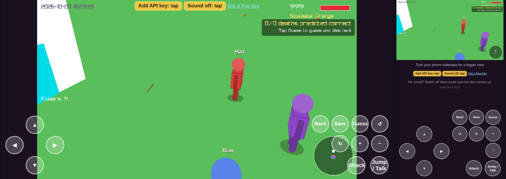

# Purple World

[**Play in Browser**](https://connorklose12.github.io/murder-mystery/) · [GitHub Repository](https://github.com/connorklose12/murder-mystery) · [CI Status](https://github.com/connorklose12/murder-mystery/actions/workflows/ci.yml)

**Technologies:** C++, Python, JavaScript, WebAssembly, Google Gemini, GitHub Actions

A 3D social simulation. With each their own complex AI system, 8 villagers form relationships, spread rumors, remember conversations, and react to the player. Google Gemini generates dynamic dialogue. No backend server is required.

I built the game in C++ and made it playable directly in a web browser. Google Gemini generates unique dialogue, while a small machine learning model helps determine how villagers feel about the player. No backend server is required.

## Gameplay Demo


## Screenshots

<table>
  <tr>
    <td></td>
    <td></td>
  </tr>
</table>

On a phone the controls sit beside the game in landscape and below it in portrait (a real game frame inside the real mobile page):




## Key Features

* **Living village:** Villagers develop crushes, form relationships, spread rumors, hold grudges, and get into fights.

* **Who dies next:** A Monte Carlo forecast replays the village 150 times using the game's own rules, refreshes every 30 seconds, and lists everyone still alive from most to least likely to die next. You lock in your own guess first and it can't be changed until someone dies. Its top pick was right 32.8% of the time on 400 simulated villages, compared with 26.2% for picking the most disliked villager and 17.0% for a uniform guess.

* **Machine learning:** Trained a small neural network in Python and integrated it into the C++ game. Its test error was 0.50, compared with 1.62 for a linear model.

* **Typed answers:** About one conversation in three is an open question the player answers by typing. Gemini grades the answer with numbers in a fixed schema (how much the villager's opinion changes, whether they shove you) and writes the reply, and the villager remembers what was said. A local neural network learns to make the same grade.

* **Training pipeline:** One script (`ml/pipeline.py`) simulates a bot player to produce villager states, has Gemini label each (state, message) pair, includes a tool to hand-check 100 labels, then trains the network and exports it to C++ with a test that C++ and Python agree. On messages it never saw, the new network's error is 2.58, compared with 3.05 for the original network and 3.67 for a hand-written rule ([results](docs/ml/ablation.md)).

* **NPC memory:** Villagers can remember information the player tells them and recall it when relevant. In a test of 58 questions, the system recalled every correct answer without any false recalls.

* **Semantic memory search:** Memory recall now uses real pretrained word vectors (GloVe-Twitter) instead of hashed words. On 480 paraphrase queries, such as "I'm obsessed with sushi" against "favorite food", the right memory ranked first 58.1% of the time, up from 25.0% (chance is 10%).

* **AI-generated conversations:** Integrated Google Gemini to generate branching conversations. Added caching to reuse responses, prefetching to reduce waiting, and error handling for failed requests.

* **Browser and mobile support:** Compiled the C++ game to WebAssembly and added touch controls, responsive layouts, and browser audio.

* **User counter:** The title menu shows how many browsers have entered an API key, kept by a public counter that is only ever sent a fixed name, never the key.

* **Save-file testing:** Built a tool to test how the game handles corrupted save files. Tested 90,000 modified saves using memory and undefined-behavior error detectors, finding and fixing a bug.

## Testing and Deployment

The project has **444 automated checks**, including:

* 197 C++ unit tests

* 223 browser integration tests

* 5 machine learning checks

* 19 data pipeline tests, run against a fake Gemini server

GitHub Actions automatically builds and tests the game. It deploys a new version only when all checks pass.

## Tech Stack

* **Languages:** C++17, Python, JavaScript

* **Game and browser:** raylib, WebAssembly, Emscripten, HTML/CSS

* **AI:** Google Gemini API, neural networks, NPC memory retrieval

* **Testing and deployment:** GitHub Actions, browser testing, fuzzing, AddressSanitizer, UndefinedBehaviorSanitizer

* **Data and ML:** scikit-learn, NumPy, GloVe word vectors, Monte Carlo simulation, Playwright

## Project Layout

```
game/        the game: main.cpp, social.h (relationships), memory.h (memory search), mcts.h (death forecast),
             npc_brain*.h (trained network), shell.html (Gemini client, audio, touch layer), assets/
ml/          pipeline.py (data, labelling, training), data/, README.md
tests/       run_all.py, pipeline tests, browser tests
docs/        demo, screenshots, ML results
.github/     the CI and deploy workflow
```

## Run Locally

```bash
git clone https://github.com/connorklose12/murder-mystery
cd murder-mystery
python tests/run_all.py
```

To build and play the game locally, see the build instructions in the repository. Playing the browser version requires your own Gemini API key for AI-generated dialogue.

To retrain the neural network or label data with real Gemini output, see `ml/README.md`.

## Limitations

* The dialogue is meant to be genuinely funny, and I avoided having the characters saying things potentially offensive or talk about overly serious topics, but there's no guarantee they won't do that so beware.

* The neural network was trained using simulated data rather than real player behavior.

* The NPC memory test used a small, synthetic dataset, so real-world accuracy may differ.

* The network's current weights were trained on an offline stand-in for Gemini's grades, so its numbers measure agreement with that stand-in until the real Gemini labelling is run (`ml/README.md` explains how).

* The death forecast was tested against the simulation's own randomness rather than real play, and the user counter depends on a third-party service.