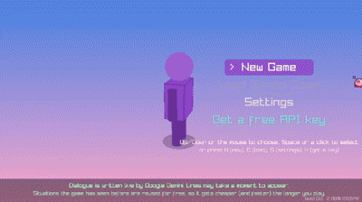
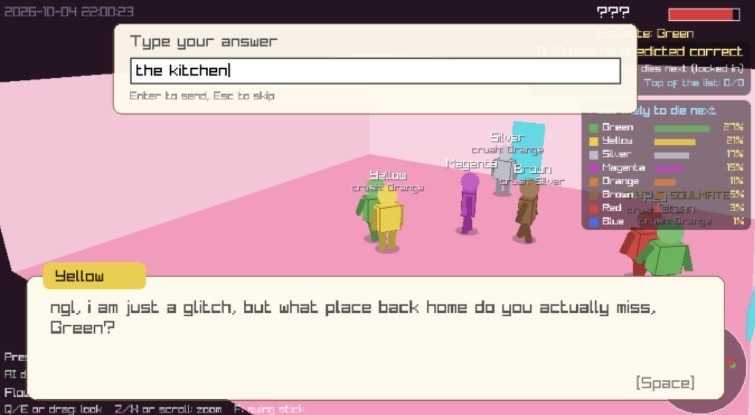
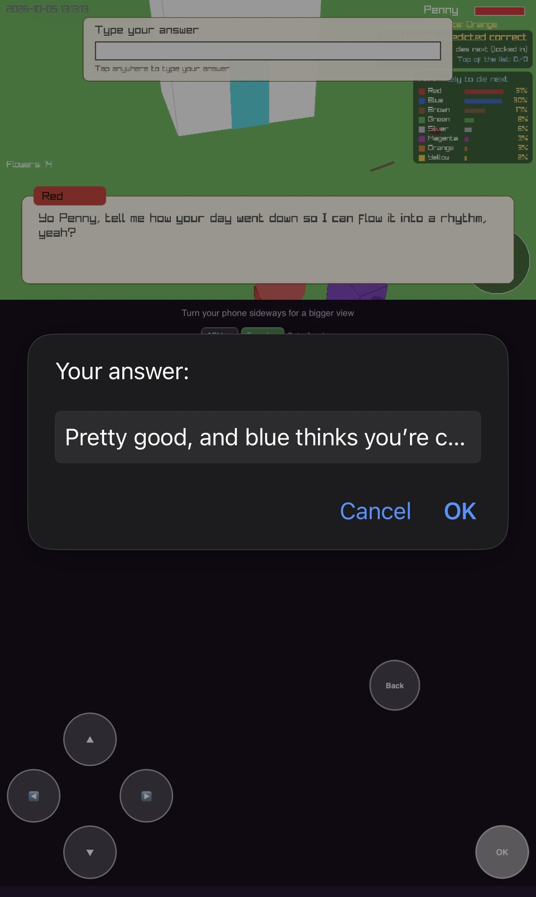

# Purple World

[**Play in Browser**](https://connorklose12.github.io/murder-mystery/) · [GitHub Repository](https://github.com/connorklose12/murder-mystery) · [CI Status](https://github.com/connorklose12/murder-mystery/actions/workflows/ci.yml)

**Technologies:** C++, Python, JavaScript, WebAssembly, Google Gemini, GitHub Actions

A 3D social simulation. With each their own complex AI system, 8 villagers form relationships, spread rumors, remember conversations, and react to the player. Google Gemini generates dynamic dialogue. No backend server is required.

I built the game in C++ and made it playable directly in a web browser, including a mobile version. Google Gemini generates unique dialogue, while a small machine learning model helps determine how villagers feel about the player. No backend server is required. 

## Gameplay Demo



## Screenshots

<table>
  <tr>
    <td></td>
    <td></td>
  </tr>
</table>

## Key Features
 
* **Living village:** Villagers develop crushes, form relationships, spread rumors, hold grudges, and get into fights.
* **Who dies next:** Built a forecast that plays out the village 150 times and ranks every living villager from most to least likely to die next. The player locks in a guess first and can't change it until someone dies. The forecast's top pick was right 32.8% of the time in a test of 400 simulated villages, compared with 26.2% for picking the most disliked villager and 17.0% for random guessing.
* **Machine learning:** Trained a small neural network in Python and integrated it into the C++ game. Its test error was 0.50, compared with 1.62 for a linear model.
* **Typed answers:** Villagers often ask questions the player answers by typing. Gemini scores the answer (how much their opinion changes and if they shove you) and writes a reply, and the villager remembers what was said. A small neural network trained on those scores can make the same call without Gemini.
* **Training pipeline:** Wrote one script that simulates a player to make thousands of villager situations, has Gemini score them, and trains the neural network on those scores. It also has a tool for checking 100 scores by hand and a test that C++ and Python give the same answers. On messages it had never seen, the new network's error was 2.58, compared with 3.05 for the old one and 3.67 for a hand-written rule ([results](docs/ml/ablation.md)).
* **NPC memory:** Villagers can remember information the player tells them and recall it when relevant. In a test of 58 questions, the system recalled every correct answer without any false recalls.
* **Semantic memory search:** Switched memory search to real pretrained word vectors, so it matches meaning instead of just matching words. On 480 test questions like "I'm obsessed with sushi" versus "favorite food", it found the right memory 58.1% of the time, up from 25.0% before (random guessing is 10%).
* **AI-generated conversations:** Integrated Google Gemini to generate branching conversations. Added caching to reuse responses, prefetching to reduce waiting, and error handling for failed requests.
* **Browser and mobile support:** Compiled the C++ game to WebAssembly and added touch controls, responsive layouts, and browser audio.
* **User counter:** The title screen shows how many people have entered an API key. The counter never receives the key itself.
* **Save-file testing:** Built a tool to test how the game handles corrupted save files. Tested 90,000 modified saves using memory and undefined-behavior error detectors, finding and fixing a bug.
## Testing and Deployment
 
The project has **444 automated checks**, including:
 
* 197 C++ unit tests
* 223 browser integration tests
* 5 machine learning checks
* 19 data pipeline tests
GitHub Actions automatically builds and tests the game. It deploys a new version only when all checks pass.
 
## Tech Stack
 
* **Languages:** C++17, Python, JavaScript
* **Game and browser:** raylib, WebAssembly, Emscripten, HTML/CSS
* **AI:** Google Gemini API, neural networks, NPC memory retrieval
* **Testing and deployment:** GitHub Actions, browser testing, fuzzing, AddressSanitizer, UndefinedBehaviorSanitizer
* **Data and ML:** scikit-learn, NumPy, GloVe word vectors, Monte Carlo simulation, Playwright
## Project Layout
 
```
game/      the game itself (C++), plus the web page that runs it
ml/        the machine learning pipeline and its data
tests/     automated tests
docs/      demo, screenshots, and ML results
.github/   the build, test, and deploy workflow
```
 
## Run Locally
 
```bash
git clone https://github.com/connorklose12/murder-mystery
cd murder-mystery
python tests/run_all.py
```
 
To build and play the game locally, see the build instructions in the repository. Playing the browser version requires your own Gemini API key for AI-generated dialogue.
 
To retrain the neural network, see `ml/README.md`.
 
## Limitations
 
* The dialogue is meant to be genuinely funny, and I avoided having the characters saying things potentially offensive or talk about overly serious topics, but there's no guarantee they won't do that so beware.
* The NPC memory test used a small, synthetic dataset, so real world accuracy may differ.
* The death forecast was only tested against the game's own simulation, not real play, and the user counter depends on a free outside service.
 