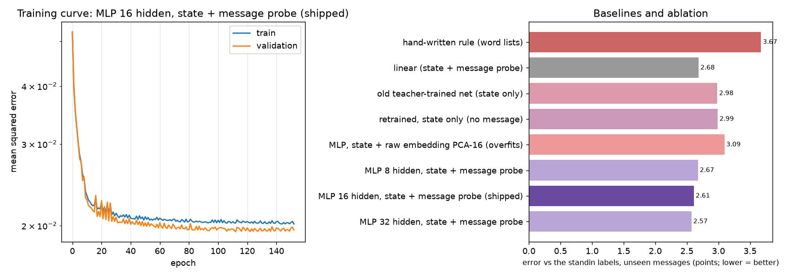

# NPC brain and memory embeddings: the data and training pipeline

Everything is one script, `ml/pipeline.py`, with one command per step:

```
pip install -r ml/requirements.txt
python ml/pipeline.py embeddings             # build game/assets/embed.bin from real pretrained GloVe-Twitter vectors (downloads ~390 MB once)
python ml/pipeline.py states                 # a headless bot player talks to villagers; record thousands of villager states
python ml/pipeline.py messages               # the built-in bank of 870 player messages in 15 categories;  add --gemini for 375 more written by Gemini
python ml/pipeline.py label --labeler standin    # offline stand-in labels (default)
python ml/pipeline.py label --labeler gemini     # REAL labels from Gemini (needs GEMINI_API_KEY; about 150 batched calls)
python ml/pipeline.py check                  # hand-check 100 labels blind and report how often you agree with the labeler
python ml/pipeline.py train                  # train, compare against baselines, export the weights into game/  (refuses to export if its checks fail)
python ml/pipeline.py train --quick          # small run for CI: changes nothing
```

## READ THIS: what the labels are

The net grades what a player types: *how much should this villager's opinion change, and would they shove you?* The **intended** answer key is Gemini's grade of each (villager state, message) pair, requested with a fixed JSON schema so the answer is numbers, not prose (`label --labeler gemini`).

**The weights currently in the repository were trained on a stand-in labeler, not on Gemini.** The stand-in (`standin_label` in `pipeline.py`) is a hand-written judge that reads each message's category and the villager's personality. Every row of `ml/data/labeled.jsonl` carries `"labeler": "standin"`, and `game/npc_brain_weights.h` records it in its first comment line. So the table below measures **how well each model recovers the stand-in's grades on messages it has never seen**. It does not measure agreement with Gemini or with real players. Run the Gemini steps (below), retrain, and the same table is produced for the real labels.

## How the message reaches the net

1. **Embedding:** a text becomes a 200-number vector: the mean and the element-wise max of its words' GloVe-Twitter vectors (100 numbers each, 20,300 words, int8, 2.2 MB), with the common component removed. Max-pooling keeps one strong word ("hate") from being diluted. The same function is implemented in Python (`Table.embed`) and C++ (`EmbedSemantic` in `game/memory.h`) and `tests.cpp` checks they agree to within 0.000001.
2. **Probe:** a regularised linear read-out turns those 200 numbers into 2 (how much the message shifts opinion, how likely it is to provoke a shove) beyond what the villager's state already explains. It is fitted on training messages only; the regularisation strength is chosen on validation messages; and for training rows its predictions are out-of-fold so the net never sees an over-fitted value.
3. **Net:** 9 state inputs + 2 message inputs → 16 tanh hidden units → 2 outputs (226 parameters). With no typed message the two message inputs are 0, and the answer-menu behaviour from the first version is kept by also training on teacher-labelled menu samples.

Why a probe and not the raw embedding? With a few hundred distinct training messages the raw embedding overfits: feeding PCA-16 of it gives **worse** error (3.13) than ignoring the message (2.99). That failed variant is kept in the table.

## Results (seed 42; 3,000 pairs; test = 444 pairs whose message text never appeared in training; labels: **standin**)

| Model | Opinion error (RMSE, points) | Shove error (MAE) | Within 3 points | Right direction | Parameters |
|---|---|---|---|---|---|
| hand-written rule (word lists) | 3.67 | 0.179 | 53% | 58% | - |
| linear (state + message probe) | 2.68 | 0.091 | 74% | 88% | - |
| **old teacher-trained net (state only)** | 3.05 | 0.066 | 72% | 85% | - |
| retrained, state only (no message) | 2.99 | 0.073 | 73% | 87% | - |
| MLP, state + raw embedding PCA-16 (overfits) | 3.13 | 0.069 | 69% | 85% | - |
| MLP 8 hidden, state + message probe | 2.68 | 0.065 | 75% | 87% | 114 |
| **MLP 16 hidden, state + message probe (shipped)** | **2.58** | 0.066 | **77%** | **89%** | 226 |
| MLP 32 hidden, state + message probe | 2.59 | 0.067 | 77% | 89% | 450 |

* The shipped net beats the **old teacher-trained net** by 15% and the hand-written word-list rule by 30% (opinion error).
* Reading the message helps: 2.58 against 2.99 for the same net without it. The remaining error is mostly the embedding's limit: a model that knew each message's true category would do far better, and averaged word vectors recover tone only partly (they are good at topic, weaker at sentiment).
* On the answer-menu samples (against the original teacher) the shipped net's error is 1.57 against 2.08 for the old net, so that behaviour was not broken.
* Training is reproducible: re-running `train` reproduces `npc_brain_weights.h` byte for byte.



## The embedding benchmark (memory retrieval)

The same table drives the villagers' memory search (`game/memory.h`). On 480 queries (10 subjects such as "favorite food" against free-form memories such as "I'm obsessed with sushi", on a half of the paraphrases never used to choose the recipe), the right memory is ranked first **58.1%** of the time, against **25.0%** for the earlier hashed-word method (chance is 10%). The table and pooling were chosen by comparing GloVe-wiki 50/100/200 and GloVe-Twitter 100 on both this benchmark and message-tone reading.

## Steps to produce REAL Gemini labels

```
set GEMINI_API_KEY=your-key            (PowerShell:  $env:GEMINI_API_KEY="your-key")
python ml/pipeline.py messages --gemini
python ml/pipeline.py label --labeler gemini      # resumes if interrupted; free-tier rate limits make this take a few minutes
python ml/pipeline.py check                       # you grade 100 blind and it reports agreement with Gemini
python ml/pipeline.py train
```

Then commit `ml/data/`, `game/npc_brain_weights.h`, `game/npc_brain_parity.h` and `docs/ml/`. If a check fails the script prints which and leaves the repository untouched.
